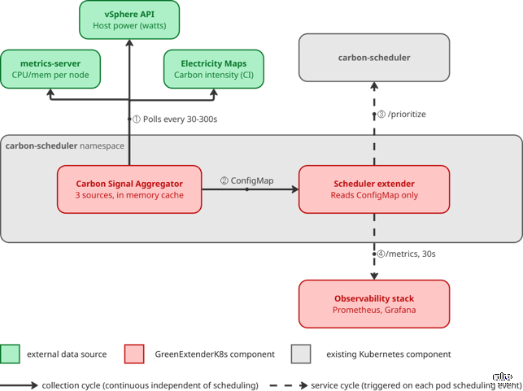

# extender

Kubernetes scheduler extender. Scores and gates pod placement based on the
carbon signal published by `carbon-signal`, the pod's workload class
(latency-sensitive / batch / best-effort), and per-node CPU/memory load.

## How it works



This service runs the **service cycle** (dashed arrows): triggered on
each pod scheduling event, it reads the `carbon-signal` ConfigMap
(never the external sources directly) to answer the scheduler's
`/filter` and `/prioritize` calls, and exposes `/metrics` every 30s for
observability.

## Usage

Opt a pod into carbon-aware scheduling with `schedulerName: carbon-aware`.
Workload class is auto-detected from owner kind + QoS (see
`workload_classifier.py`) but can be overridden with a label; delay
behavior for flexible pods is controlled with annotations (`temporal.py`):

```yaml
apiVersion: v1
kind: Pod
metadata:
  name: nightly-report
  labels:
    carbon-class: batch                             # optional override — auto-detected otherwise
  annotations:
    carbon-aware/flexible: "true"                    # batch/best-effort are flexible by default; "false" opts out
    carbon-aware/deadline: "2026-07-17T06:00:00Z"     # must run by this time regardless of grid CI
    carbon-aware/max-delay-hours: "12"                # overrides DEFAULT_MAX_DELAY_HOURS for this pod
spec:
  schedulerName: carbon-aware
  containers:
    - name: report
      image: my-batch-job:latest
```

Without a deadline or `max-delay-hours`, flexible pods fall back to
`DEFAULT_MAX_DELAY_HOURS`. Latency-sensitive pods (the default for
ReplicaSets/StatefulSets) are never delayed unless they explicitly opt
in via `carbon-aware/flexible: "true"` or a deadline.

## Environment variables

All variables are optional — every one has a default. In the cluster,
values are set via `manifests/extender/extender-deployment.yaml`; for
local runs, copy `.env.example` to `.env`.

| Variable | Default | Used by | Description |
|---|---|---|---|
| `SIGNAL_FILE` | `/etc/carbon-signal/signal.json` | `signal_loader.py` | Path to the carbon signal JSON, mounted from the `carbon-signal` ConfigMap. Override in local dev to point at a mock file. |
| `SIGNAL_CACHE_TTL` | `5` | `signal_loader.py` | In-memory cache TTL (s) for the signal file — avoids re-reading on every `/filter` and `/prioritize` call |
| `MAX_SIGNAL_AGE` | `600` | `signal_loader.py` | Maximum accepted signal age (s). Beyond this, the extender fails safe and schedules immediately instead of gating on stale data |
| `GREEN_THRESHOLD_G_PER_KWH` | `40` | `temporal.py` | Local-dev-only fallback "green" carbon-intensity threshold. In production, dynamic thresholds from the carbon-signal ConfigMap (P15/P85 of forecast or monthly historical table) always take precedence over this. |
| `DIRTY_THRESHOLD_G_PER_KWH` | `70` | `temporal.py` | Local-dev-only fallback "dirty" threshold. Same override rule as above. |
| `DEFAULT_MAX_DELAY_HOURS` | `24` | `temporal.py` | Maximum hours a flexible (batch/best-effort) pod can be delayed, unless overridden per-pod via the `carbon-aware/max-delay-hours` annotation |
| `MIN_GAIN_TO_DELAY_G_PER_KWH` | `10` | `temporal.py` | Minimum carbon-intensity gain (gCO2eq/kWh) required to justify delaying a pod — avoids delaying for a negligible improvement |
| `SCORING_W_CPU` | `0.7` | `scoring.py` | Weight of CPU load in the marginal-cost node scoring formula |
| `SCORING_W_MEM` | `0.3` | `scoring.py` | Weight of memory load in the marginal-cost node scoring formula |
| `IN_CLUSTER` | `false` | `extender.py` | Set to `"true"` only when running inside a Kubernetes pod — switches from local `~/.kube/config` to the in-cluster service account config |

## Local run

```bash
cp .env.example .env    # tune if needed, defaults work standalone
pip install -r requirements-dev.txt
uvicorn extender:app --host 0.0.0.0 --port 8080
```
